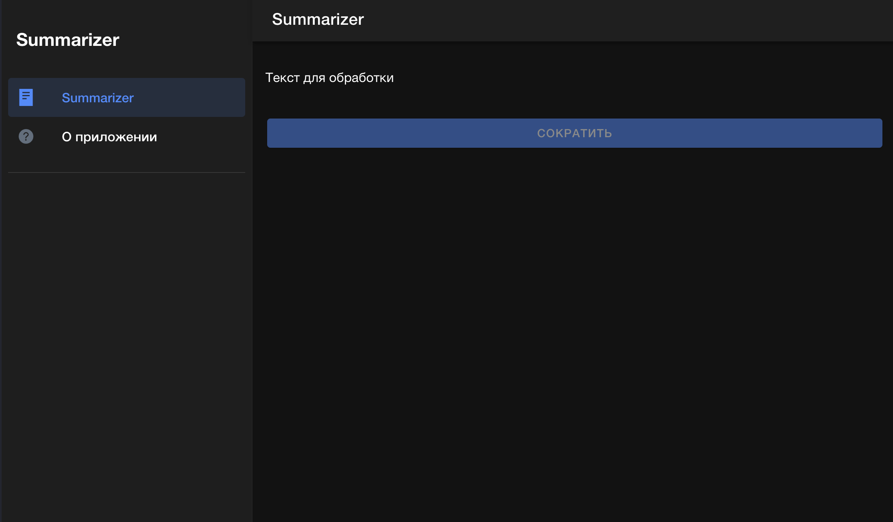
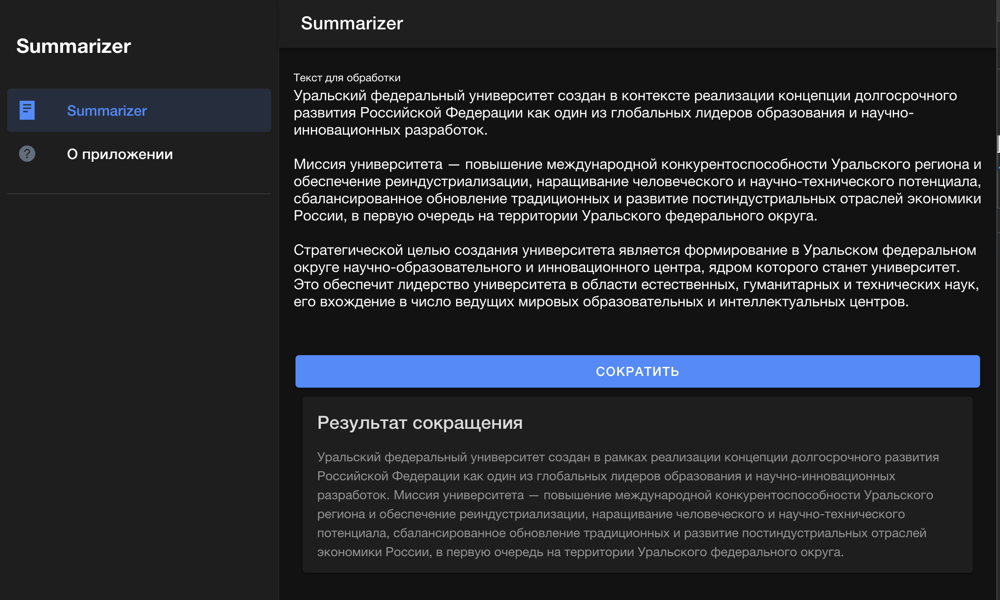
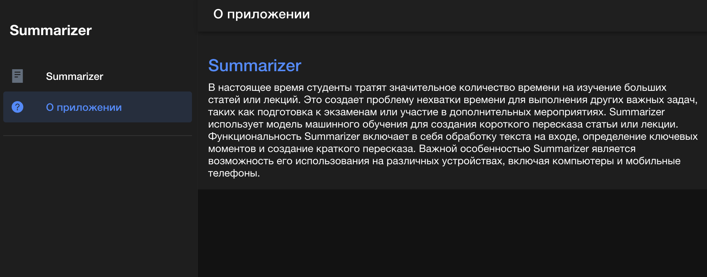
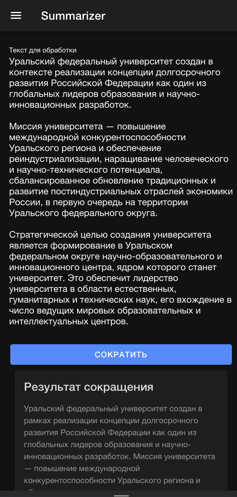
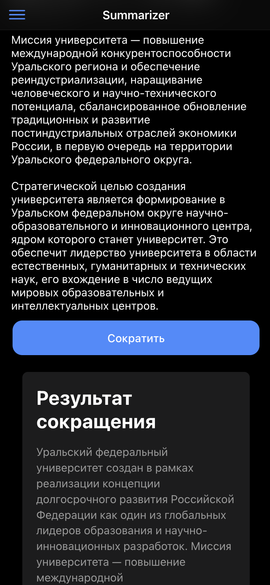

# Короткий пересказ текста

УрФУ: Проектный практикум

---

### [Описание проекта](docs/project-description.md)

### [API](summarizer/README.md)

### [Фронтенд и мобильное приложение](summarizer-front/README.md)

---

## Начало работы

Для работы требуется:

- утилита [make](https://www.gnu.org/software/make/)
- [Docker](https://www.docker.com/)
- [Docker Compose](https://docs.docker.com/compose/)

Для корректной работы приложения необходимо задать данным переменным значения в
файле [docker-compose.yml](deployment/docker-compose.yml) для сервиса `back`:

- `SUMMARIZER_TYPE` - `remote` или `local`. Определяет, какой сервис использовать: запускать модель локально или с
  помощью http-запроса к API huggingface;
- `API_TOKEN` - токен, полученный в huggingface.

Запуск приложения в Docker

```shell
make up
```

Остановка контейнеров

```shell
make down
```

По умолчанию сервис доступен по адресу http://localhost/main

## Использование

1. Введи текст для обработки.
1. Нажми `Сократить`.
1. Используй результат!

### Веб-приложение





### Android-приложение



### iOS-приложение



## Команда

- **Менеджер проекта/Scrum-мастер**: Иноземцев И.В.
- **Аналитик данных/Data Scientist**: Иноземцев И.В.
- **Инженер по машинному обучению (ML Engineer)**: Иноземцев И.В.
- **Full Stack-разработчик**: Иноземцев И.В.
- **Тестировщик-QA инженер**: Иноземцев И.В.
- **Документалист/технический писатель**: Иноземцев И.В.
- **Документалист/технический писатель**: Иноземцев И.В.
- **И швец, и жнец, и на дуде игрец**: Иноземцев И.В.

## Лицензия

[Лицензия MIT](https://mit-license.org/)

Copyright © 2023 Иноземцев И.В.