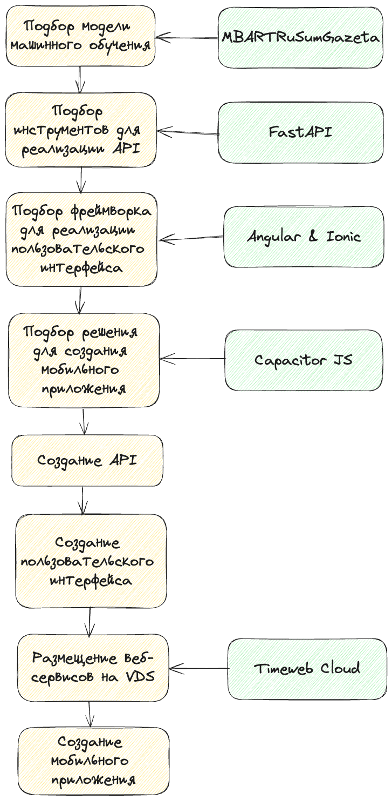

# Описание проекта "Короткий пересказ текста"

## Введение

Проект ставит перед собой цель создания IT-решения для упрощения процесса поиска информации среди больших объемов
данных.

Основные задачи включают подбор подходящей готовой модели машинного обучения, создание удобного
пользовательского интерфейса и оптимизацию производительности приложения для обеспечения быстрого и точного пересказа.

## Анализ проблемы

В настоящее время студенты тратят значительное количество времени на изучение больших статей или лекций. Это создает
проблему нехватки времени для выполнения других важных задач, таких как подготовка к экзаменам или участие в
дополнительных мероприятиях.

## Описание решения

Предлагаемое IT-решение будет использовать модель машинного обучения для создания короткого пересказа
статьи или лекции.

Функциональность решения включает в себя обработку текста на входе, определение ключевых моментов и создание краткого
пересказа.

Важной особенностью решения является возможность его использования на различных устройствах, включая компьютеры и
мобильные телефоны.

### План реализации проекта включает следующие этапы:

### Ссылки на инструменты
- Модель [MBARTRuSumGazeta](https://huggingface.co/IlyaGusev/mbart_ru_sum_gazeta)
- [FastAPI](https://fastapi.tiangolo.com/)
- [Angular](https://angular.dev/)
- [Ionic](https://ionicframework.com/)
- [Capacitor](https://capacitorjs.com/)
- [Timeweb Cloud](https://timeweb.cloud/)

## Практическая ценность и применимость

Практические преимущества использования сервиса включают сокращение времени на поиск информации, повышение эффективности
учебного процесса и улучшение пользовательского опыта.

Сервис решает такие проблемы, как большой объем информации и сложность ее обработки, и помогает достичь поставленных
целей проекта по созданию удобного инструмента для работы с большими объемами данных.

## Команда и план действий

Команда состоит из Иноземцева И.В. 
Он отвечает за выполнение каждого из этапов плана реадизации проекта, описанного выше.

### Примерная оценка на выполнение в днях
- подбор инструментов - 1 день
- создание API - 1 день
- создание пользовательского интерфейса - 2 дня
- докеризация и размещение на VDS - 2 дня
- создание мобильного приложения под Android и размещение APK в репозитории - 2 дня

## Заключение

Основными достижениями сервиса являются создание эффективного инструмента для работы с большими объемами текста и
сокращение времени на обработку информации.
